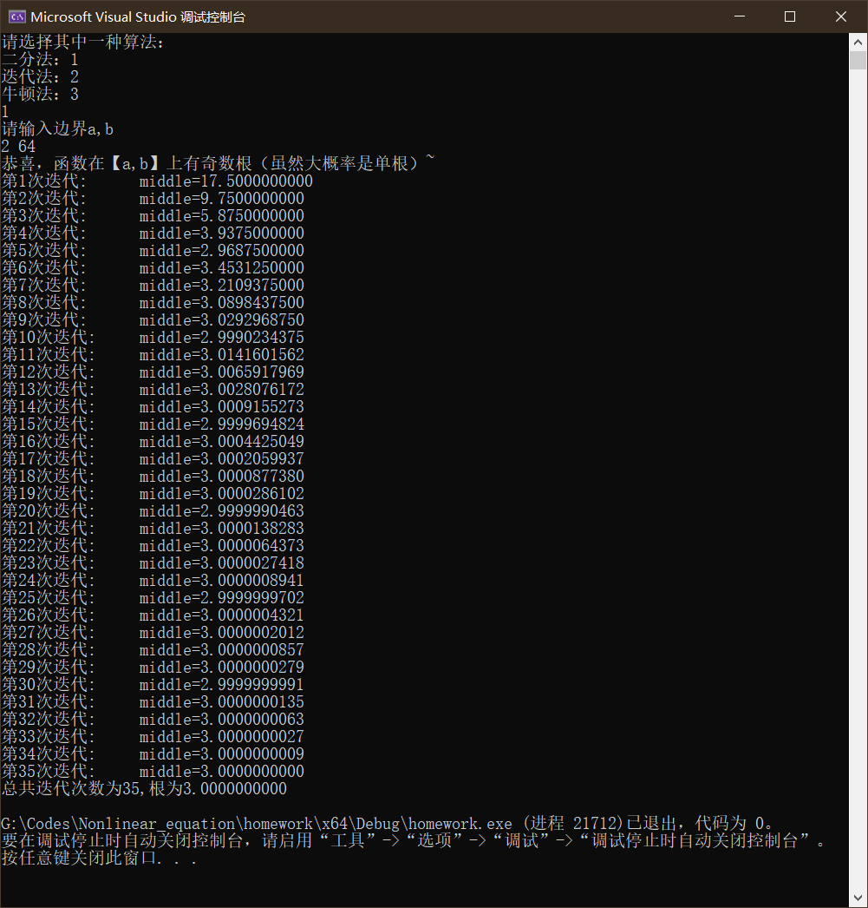
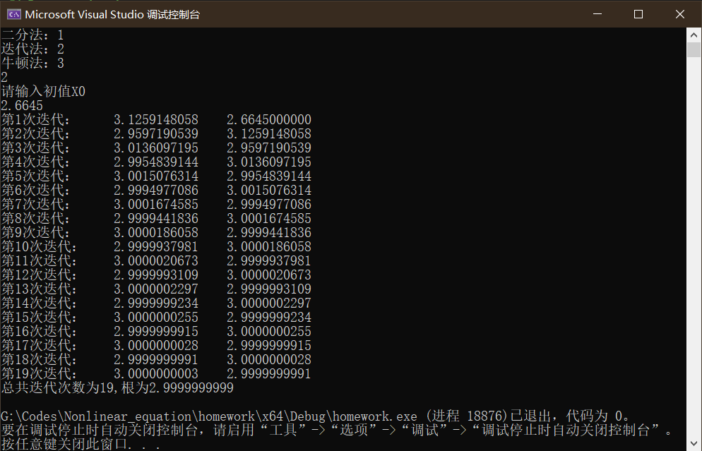
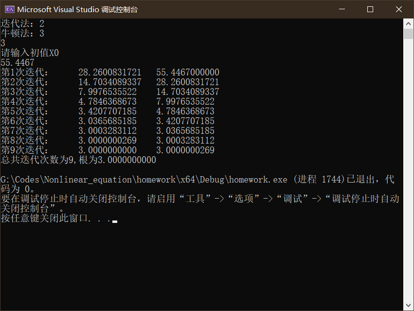

# 简介

本项目完成了三种算法的非线性方程求解

包括二分法、一般迭代法、牛顿法

都是最经典的方法，未采取加速

# 代码注意事项

## 1、需要自己在my_math.c中更新三个函数内容

```c++
/***************注意自己更新以下三个函数**************/

double my_func(double x) {return x * x - 2 * x - 3;}//原函数 f(x);
double func_iteration(double x) {return 2 + 3 / x;}//迭代函数 g(x);
double my_dfunc(double x) {return 2 * x - 2;}//导函数 f'(x);
```

## 2、【a,b】区间需要有单根，迭代函数需要收敛，根据需要自己修改迭代上限、误差限


# 程序演示

以原函数f(x) = x^2 -2x -3为例

## 1、二分法



## 2、一般迭代法



## 3、牛顿迭代法

